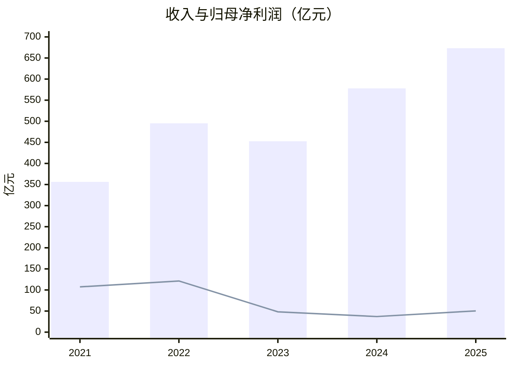
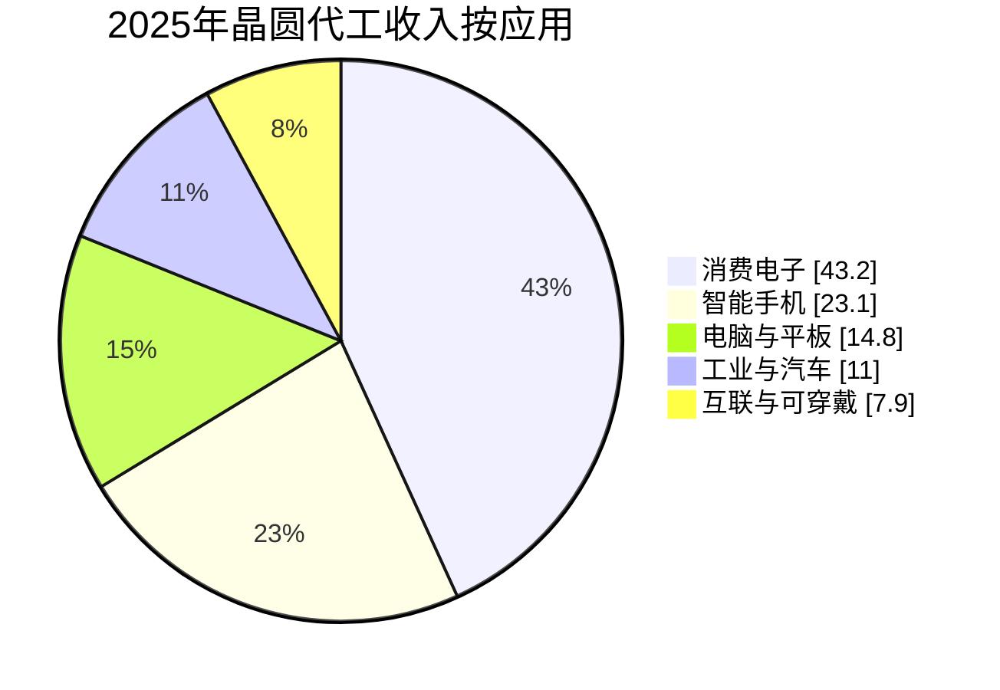

# 中芯国际投资研究：战略稀缺性很强，但价格决定回报

> 数据截止：2026-07-31 15:25 CST；最新已披露经营数据为 2026 年第一季度。  
> 证券：A 股 688981.SH / H 股 00981.HK。  
> 信息丰富度评级：**A级（信息充裕）**。  
> 结论：**公司层面观望；A 股回避追高，H 股持有/等待更大安全边际。**  
> 本报告用于学习和研究，不构成投资建议。

## 结论先行

中芯国际是中国大陆规模最大、工艺平台最完整的晶圆代工厂。它的核心价值不是“已经成为中国版台积电”，而是以巨额固定资产、工艺配方、良率学习、客户认证和本土供应链协同，为芯片设计公司提供可重复的制造能力，并承载中国半导体供应链安全的战略期权。

这门生意有真实壁垒，但经济性尚未达到一流：2025 年产能利用率升至 93.5%，收入增长 16.5%，毛利率回升至 21.6%；与此同时，经营现金流 200.81 亿元远低于 599.51 亿元资本性现金支出，粗略自由现金流为 -398.70 亿元。战略价值正在兑现为订单和产能利用率，尚未兑现为可持续的每股自由现金流。

更重要的是 A/H 定价割裂。截至本报告价格快照，A 股 123.99 元，H 股约 63.30 港元；按 1 港元兑 0.86117 元人民币换算，A 股较 H 股溢价约 127.5%。使用交易后备考 EPS 0.716 元：

| 估值快照 | A 股 | H 股等值 |
|---|---:|---:|
| 股价 | 123.99 元 | 63.30 港元 / 54.51 元 |
| 备考 PE | 173.2 倍 | 76.2 倍 |
| 备考 PB | 6.19 倍 | 2.72 倍 |
| PS | 15.77 倍 | 6.93 倍 |
| EV/2025 EBITDA | 28.24 倍 | 12.48 倍 |
| 粗略 FCF Yield | -3.76% | -8.54% |

本报告的三情景概率加权价值约为 **57.3 元人民币/股，或 66.5 港元/股**。合理区间取 **50-75 元人民币**，对应 **58-87 港元**。当前 A 股即使在乐观情景下仍缺乏安全边际；H 股接近合理价值，但并非明显低估。

## 0. AI 研究偏见自觉

### 为什么是 A 级

中芯国际同时在上交所和港交所上市，有中英文年报、季度经营数据、业绩会资料、监管文件及大量产业研究。财务、产能和客户结构资料充足；但先进制程良率、节点收入、关键客户份额和受限设备库存属于非公开信息。

A级公司的主要 AI 陷阱是把资料丰富误当作投资确定性，并复述“国产替代、先进制程突破、全球第二”这些已被市场广泛讨论的共识。为避免共识回音，本报告重点检验三个反面问题：

1. 战略价值能否转化为少数股东自由现金流？
2. 无 EUV 的先进制程是可盈利生意，还是高成本战略能力？
3. 如果中芯只是“超大号中国联电”，当前价格是否仍合理？

### 偏见自查

- [x] 确定性主要来自公司披露的收入、现金流和利用率，而非报道数量。
- [x] 对先进节点占比、良率、客户份额不作伪精确估计。
- [x] 明确区分“全球第二大纯晶圆代工厂”和“包含三星后的全球第三”。
- [x] 将政策融资能力视为护城河，同时视为股东回报可能让位于产业目标的治理风险。

### AI 研究局限性声明

财务数据置信度高；行业份额和出口管制置信度中高；先进制程良率、成本和客户结构置信度中低。公开拆解可以证明 7nm-class 芯片存在，不能证明该节点的规模、良率或盈利能力。A/H 股不能自由转换，价差可能长期存在，不能把理论等值直接当成可执行套利。

## 1. 数据收集与经营快照

### 五年财务趋势

单位：亿元人民币；毛利率、经营利润率除外。FCF 定义为经营现金流减购建固定资产、无形资产及其他长期资产支付的现金，不等同于公司披露的非 GAAP 指标。

| 年度 | 收入 | 归母净利润 | 毛利率 | 经营利润率 | 经营现金流 | 资本性现金支出 | 粗略 FCF | 货币资金 |
|---|---:|---:|---:|---:|---:|---:|---:|---:|
| 2021 | 356.31 | 107.33 | 29.3% | 32.7% | 208.45 | 283.62 | -75.17 | 798.75 |
| 2022 | 495.16 | 121.33 | 38.3% | 29.8% | 365.91 | 422.06 | -56.14 | 749.22 |
| 2023 | 452.50 | 48.23 | 21.9% | 15.3% | 230.48 | 538.65 | -308.17 | 512.35 |
| 2024 | 577.96 | 36.99 | 18.6% | 10.9% | 226.59 | 545.59 | -319.01 | 480.29 |
| 2025 | 673.23 | 50.41 | 21.6% | 12.3% | 200.81 | 599.51 | -398.70 | 436.45 |

来源：[2025 年报（公司披露镜像）](https://pdf.dfcfw.com/pdf/H2_AN202603261820774268_1.pdf?1774554593000.pdf)、[公司英文 2025 年报](https://smic.cdn.shwebspace.com/uploads/AR_EN.pdf)、[东方财富 F10 财务数据](https://datacenter.eastmoney.com/securities/api/data/v1/get?reportName=RPT_F10_FINANCE_MAINFINADATA&columns=ALL&filter=(SECUCODE%3D%22688981.SH%22)&pageNumber=1&pageSize=20&sortTypes=-1&sortColumns=REPORT_DATE&source=HSF10&client=PC)。

2021-2022 的高利润包含行业景气、价格、产能和政府支持等多重因素，不能直接作为常态盈利。2023 年后收入恢复，但折旧和扩产压力使利润率及自由现金流明显弱化。

### 最近四季度与 2026Q1

| 期间 | 收入（亿元） | 归母净利润（亿元） | 经营现金流（亿元） |
|---|---:|---:|---:|
| 2025Q2 | 160.47 | 9.44 | 70.69 |
| 2025Q3 | 171.62 | 15.17 | 63.90 |
| 2025Q4 | 178.13 | 12.23 | 77.93 |
| 2026Q1 | 176.17 | 13.61 | 51.32 |

2026Q1 按中国企业会计准则收入同比增长 8.1%，归母净利润增长 0.4%；按国际财务报告准则销售收入 25.05 亿美元、毛利率 20.1%。公司给出的 2026Q2 指引是收入环比增长 14%-16%、毛利率 20%-22%，这是前瞻指引，不是已实现业绩。2026Q2 业绩会计划于 2026-08-14 举行。

来源：[2026Q1 季报（公司披露镜像）](https://pdf.dfcfw.com/pdf/H2_AN202605141822318590_1.pdf?1778790758000.pdf)、[公司英文 2026Q1 业绩资料](https://smic.cdn.shwebspace.com/uploads/6a057e3f/ER_EN.pdf)。

### 2026Q1 经营指标

| 指标 | 2025Q1 | 2025Q4 | 2026Q1 |
|---|---:|---:|---:|
| 晶圆出货量（8 英寸等值，万片） | 229.22 | 251.50 | 250.91 |
| 月产能（8 英寸等值，万片） | 97.33 | 105.88 | 107.83 |
| 产能利用率 | 89.6% | 95.7% | 93.1% |
| 资本支出（亿元） | 101.57 | 170.43 | 108.71 |
| 中国区收入占比 | 84.3% | 87.6% | 88.9% |

产能利用率仍高，但 2026Q1 出货环比略降；高利用率既有国产替代，也包含消费电子、显示及 PC 备货的周期成分。

### 现金、债务和股本

2025 年末公司披露有息债务 886.12 亿元，货币资金、交易性金融资产、长期定期存款等合计后净债务 46.43 亿元。2026Q1 货币资金升至 556.10 亿元，但短期借款、一年内到期非流动负债和长期借款也合计约 1,004.54 亿元；由于季报未完整拆分长期定期存款，不能只用“货币资金减债务”断言流动性恶化。

2026 年 6 月，公司以每股 74.20 元发行 5.4718 亿股 A 股，购买中芯北方剩余 49%股权，交易对价 406.01 亿元。交易后中芯北方成为全资子公司，不新增商誉，备考 EPS 增厚；总股本随后增至约 85.6081 亿股。该交易提升归母权益和利润，但也意味着历史每股指标必须按新股本重算。

来源：[发行结果及股本变动公告](https://pdf.dfcfw.com/pdf/H2_AN202606241823815997_1.pdf?1782326787000.pdf)、[交易报告书](https://pdf.dfcfw.com/pdf/H2_AN202605211822657783_1.pdf?1779403606000.pdf)。

## 2. 生意本质：段永平的“对的生意”

### 一句话定义

**中芯国际用巨额资本、工艺配方、良率学习和客户认证，把芯片设计反复、稳定地变成晶圆；其额外价值是中国本土制造安全。**

### 收入结构

2025 年晶圆代工收入 627.94 亿元，占总收入约 93.3%；其他业务包括光掩模、测试及配套服务。晶圆收入按应用拆分：

12 英寸占晶圆收入 77.1%，8 英寸占 22.9%。中国区占主营业务收入 85.6%，美国区 11.6%，欧亚区 2.8%。2026Q1 消费电子占比进一步升至 46.2%，工业与汽车升至 14.0%，智能手机降至 18.9%。

### 商业模式画布

| 要素 | 判断 |
|---|---|
| 收费方式 | 按晶圆和服务一次性结算，不是订阅 |
| 复购来源 | PDK/IP 适配、流片验证、良率爬坡、长期供货和车规认证 |
| 客户锁定 | 中高；重新流片需要设计迁移、掩膜、认证和良率重爬 |
| 定价权 | 有限；紧缺节点可提价，成熟节点供过于求时价格承压 |
| 经营杠杆 | 极高；高固定成本使利用率和 ASP 的小变化放大利润 |
| 资本强度 | 极高；技术迭代和扩产持续吞噬现金 |
| 网络效应 | 弱；更接近生态规模效应，而非用户网络效应 |

### 毛利率为什么显著低于台积电

中芯的 2025 毛利率约 21%，而台积电的优势来自先进节点定价、良率、规模、IP/EDA 生态、先进封装与客户共同研发的完整闭环。中芯的收入主体仍是成熟/特色工艺，扩产带来高折旧；先进制程虽然具有稀缺性，但 DUV 多重曝光可能增加掩膜、工序、周期和良率成本。因此“能制造”不等于“能以一流回报制造”。

### 经营杠杆

2024 至 2025 年收入增长 16.5%，毛利增长 35.5%，经营利润增长约 31.8%，说明利用率从低位回升时经营杠杆向上。但资本性现金支出仍高于收入增长所带来的经营现金流，股东尚未获得自由现金流杠杆。

**段永平式追问：这门生意好在哪？**  
好在制造 know-how、认证和规模很难复制，中国客户对本土稳定产能有真实需求；不好在资本开支近乎永续，技术领先和股东自由现金流仍不足。

## 3. 护城河：巴菲特的经济城堡

| 护城河类型 | 强度 | 证据与限制 |
|---|---:|---|
| 品牌/定价权 | 3/5 | 中国大陆龙头、可信赖交付；成熟节点仍受价格竞争约束 |
| 转换成本 | 4/5 | PDK、掩膜、验证、良率和车规认证使迁移昂贵 |
| 网络效应 | 2/5 | 客户不会因其他客户加入直接受益；IP/EDA/封测生态有间接效应 |
| 规模效应 | 中国 4/5、全球 2/5 | 2026Q1 份额约 5.1%，远低于台积电 72.0% |
| 技术/专利 | 国内 4/5、全球 2/5 | 累计 14,511 件授权专利；成熟平台完整，但先进设备受限 |
| 供应链/政策协同 | 4/5 | 国家级股东、融资和国产供应链协同，降低生存与扩产风险 |

公司 2025 年研发投入 55.19 亿元，占收入 8.2%，研发人员 2,403 人；公开重点项目主要是 28nm ULL、28nm 嵌入式闪存、65nm RF-SOI、90nm BCD、8 英寸 BCD/模拟、车规 eNVM 和高压显示驱动。这表明成熟/特色工艺是商业底盘。

TechInsights 拆解确认麒麟 9000S 使用中芯 N+2 7nm-class 工艺，后续 N+3 仍是 7nm-class 的继续缩放，而不是已达到台积电/三星商业 5nm 的密度和经济性。先进制程能力是真实的战略期权，但节点名称不能代替良率、成本、产量和客户广度。

过去五年，护城河在中国境内变宽：产能、工艺平台、客户认证和国产协同增强；全球技术护城河则因 EUV、先进设备和服务受限而承压。未来五年最可能形成“国内宽、全球窄”的双层护城河。

来源：[TechInsights：Kirin 9000S / SMIC N+2](https://www.techinsights.com/blog/hisilicon-kirin-9000s-smic-7nm-n2-process-flow-full-analysis)、[TechInsights：SMIC N+3](https://www.techinsights.com/blog/smic-n3-confirmed-kirin-9030-analysis-reveals-how-close-smic-5nm)。

**巴菲特式追问：十年后护城河还在吗？什么能摧毁它？**  
国内认证、规模和供应链协同大概率仍在；真正能摧毁经济护城河的是设备与服务断供导致技术/良率停滞，或政策驱动的成熟产能过剩把行业变成低回报公用事业。

## 4. 逆向思考：芒格的“反过来想”

下列概率是研究判断，不可相加，也不是统计预测。

| 失败路径 | 五年主观概率 | 影响 | 早期信号 |
|---|---:|---:|---|
| 出口管制进一步切断设备、备件、软件或服务 | 35% | 极高 | 先进线扩产延迟、折旧上升但产出不增 |
| 中国成熟制程结构性过剩 | 45% | 高 | 利用率低于 80%、ASP 连续下降 |
| 资本开支长期不产生超过资本成本的回报 | 55% | 高 | ROE 长期低于 5%、FCF 持续大幅为负 |
| 关键技术人才流失或继任失败 | 25% | 高 | 联席 CEO/核心研发团队异常变动 |
| 消费电子周期逆转 | 50% | 中高 | 订单取消、库存上升、毛利率低于 15% |
| 地缘冲突或证券投资限制升级 | 20% | 极高 | 更多司法辖区实施直接限制 |
| A 股战略溢价均值回归 | 70% | 高 | A/H 溢价收窄、估值倍数快速压缩 |

### 最强空方论点

1. 中芯是重要资产，但少数股东买到的是每股现金流，不是国家战略口号。
2. 2025 年资本性现金支出接近全年收入，经营现金流只覆盖约三分之一；扩产越快，折旧和融资需求越高。
3. 无 EUV 的 7nm-class 可能“能做但不赚钱”，先进能力未必形成商业护城河。
4. 中国厂商贡献全球 12 英寸成熟制程新增产能约 70%，国产替代与价格战可能同时发生。
5. 中国区收入接近九成，地域和政策集中度上升。
6. A 股 173 倍备考 PE 已经提前支付多年高增长，任何执行偏差都会触发估值压缩。

### 历史类比

- **联电 / GlobalFoundries**：退出最先进节点后可改善经营稳定性，却牺牲技术溢价。中芯可能成为更大、更具战略性的中国联电。
- **台积电 2008-2009 逆周期扩产**：技术领先、客户锁定和高回报使逆周期投入扩大优势；中芯缺少同等的自由现金流和全球技术领先，类比只成立一半。
- **Intel 节点延期**：节点标签不等于良率、成本和批量制造竞争力。
- **中国面板/光伏**：产业政策能快速建立规模，也可能把超额利润变成产能和低价格。

来源：[美国实体清单及 Footnote 5 规则](https://www.federalregister.gov/documents/2024/12/05/2024-28267/additions-and-modifications-to-the-entity-list-removals-from-the-validated-end-user-veu-program)、[外国直接产品规则](https://www.federalregister.gov/documents/2024/12/05/2024-28270/foreign-produced-direct-product-rule-additions-and-refinements-to-controls-for-advanced-computing)。

**芒格式追问：我最可能在哪里犯错？聪明人为什么不买？**  
最可能的错误是把产业必需性等同于高 ROIC，或把技术突破等同于可盈利量产。聪明人不买 A 股的最充分理由不是公司会失败，而是成功已被过度定价。

## 5. 管理层：对的人与资本配置

### 核心团队

- 董事长刘训峰拥有大型产业与国企管理背景。
- 联席 CEO 赵海军有三十多年半导体运营和技术经验，侧重制造与经营。
- 联席 CEO 梁孟松有四十多年半导体研发经验，是先进逻辑路线的关键人物。
- 研发和制造团队覆盖工艺整合、特色工艺、量产和良率管理。

### 关键决策复盘

| 时间 | 决策 | 结果 | 评分 |
|---|---|---|---:|
| 2017 至今 | 引入梁孟松并推进 N+1/N+2/N+3 | 证明无 EUV 条件下仍能迭代先进逻辑 | 4/5 |
| 2020 后 | 实体清单压力下继续扩产和国产协同 | 收入与国内地位提升，但资本强度极高 | 4/5 战略 / 2.5/5 财务 |
| 2023-2025 | 大规模扩充 12 英寸与特色工艺产能 | 利用率恢复至 93.5%，FCF 大幅为负 | 3/5 |
| 2026 | 发行股份收购中芯北方剩余 49% | 交易后 EPS 增厚、不新增商誉，股本增加约 6.8% | 3.5/5 |
| 长期 | 不分红、少回购，现金优先投入主业 | 符合产业目标，少数股东回报未验证 | 2/5 |

2025 年员工股权激励覆盖 3,450 人，相关员工持股约占总股本 1.56%。这有助于留才，但公司没有创始人式高持股经营者；主要战略股东和董事会结构有利于融资、政策与产业协同，也可能使资本配置优先服务产能和技术安全。

收购中芯北方的积极之处是把已合并子公司的少数股东利润转为归母利润，且不新增商誉。保守之处是 406.01 亿元对价以市场法评估为基础、约为标的净资产账面值的两倍；交易是否真正创造价值，仍需未来利润和自由现金流验证。

**段永平式追问：如果 CEO 退休，公司还能保持竞争力吗？**  
成熟工艺和制造体系已组织化，赵海军/梁孟松的双核心也降低单一 CEO 风险；但先进逻辑仍有明显关键人物依赖，继任机制是中等偏高风险。

## 6. 行业与文明趋势：李录的长期视角

半导体是数字文明的基础设施，AI、汽车电子、工业自动化和边缘计算将长期增加晶圆需求。对中国而言，供应链在地化不仅是经济选择，也是安全约束，因此中芯的战略位置具有二十年尺度的持续性。

但文明级趋势的利润并不会平均分配。2026Q1 全球前十大晶圆代工收入约 479.5 亿美元，台积电占 72.0%，三星约 6.5%，中芯约 5.1%，联电约 3.9%，华虹集团约 2.5%。公司年报所称“全球第二大纯晶圆代工厂”排除了三星 IDM 代工业务；TrendForce 包含三星时，中芯为全球第三。

| 公司 | 2026Q1 份额 | 核心定位 |
|---|---:|---|
| 台积电 | 72.0% | 先进节点、先进封装与生态平台 |
| 三星 Foundry | 6.5% | 先进 GAA 节点，商业执行弱于台积电 |
| 中芯国际 | 5.1% | 中国规模最大，成熟/特色为主，先进逻辑为战略期权 |
| 联电 | 3.9% | 成熟制程、资本纪律 |
| 华虹集团 | 2.5% | 功率、MCU、eNVM、模拟和显示驱动 |

TrendForce 预计 2026 年全球晶圆代工收入约 2,188 亿美元，同比增长 24.8%，但增量主要来自 AI GPU/xPU 和 5/4nm 及以下先进节点，不能直接把行业增速套给中芯。成熟节点短期受 PMIC、功率、边缘 AI 及 8 英寸供给收缩支撑；中期则面临中国 12 英寸新增产能过快的风险。

来源：[TrendForce 2026Q1 排名](https://www.trendforce.com/presscenter/news/20260612-13095.html)、[TrendForce 2026 行业预测](https://www.trendforce.com/presscenter/news/20260319-12979.html)、[成熟制程供需](https://www.trendforce.com/presscenter/news/20260507-13036.html)。

### 价值链位置

上游受制于光刻、刻蚀、沉积、量测、EDA、材料和零部件；下游连接 Fabless、IDM、封测和终端品牌。中芯是中国价值链中的关键瓶颈节点，因此拥有政策与订单优势；但上游设备限制同时是其技术天花板。

### 二十年后的判断

中芯更可能成为“战略性半导体基础设施”，而非标准石油式高定价权垄断者。它也不太像会消失的 3Com：本土客户和产业安全需求提供持续存在理由。真正的长期问题不是存在与否，而是资本回报率会接近优秀平台企业，还是更接近重资产公用事业。

**李录式追问：二十年后回看，它是标准石油还是 3Com？**  
两者都不是。更可能是不可或缺、技术持续进步，但资本回报受政策目标、设备约束和周期竞争压制的国家级制造平台。

## 7. 估值与安全边际

### A/H 两套“总市值”

中芯 A/H 股每股经济权益基本相同，但股份不能自由转换，两地投资者、流动性和风险偏好不同。因此不能把 A 股市值与 H 股市值相加；应分别用 A 价或 H 价乘全部股本，得到两套隐含股权价值。

2026-07-31 价格快照：

- A 股：腾讯与新浪均为 123.99 元；总股本约 85.6081 亿股，A 价隐含股权价值约 10,614.54 亿元。
- H 股：腾讯 63.30 港元，新浪 63.05 港元；以 63.30 港元计，H 价隐含股权价值约 5,418.99 亿港元。
- 汇率：1 港元兑 0.86117 元人民币，H 股 63.30 港元约合 54.51 元。

行情来源：[腾讯 A 股行情](https://qt.gtimg.cn/q=sh688981)、[腾讯 H 股行情](https://qt.gtimg.cn/q=hk00981)、[新浪行情](https://hq.sinajs.cn/list=sh688981,hk00981)、[Frankfurter/ECB 汇率](https://api.frankfurter.app/2026-07-31?from=HKD&to=CNY)。

### 备考每股指标

2025 归母净利润 50.407 亿元；中芯北方 2025 净利润 22.197 亿元。交易后新增归母利润按 49%计约 10.876 亿元，备考归母利润约 61.284 亿元，除以最新总股本得到备考 EPS 0.716 元。交易报告书披露的 2024 备考 EPS 为 0.53 元，2025 年前八个月备考 EPS 为 0.55 元，验证了交易具有每股增厚效应。

备考归母净资产约 1,714.45 亿元，对应 BVPS 20.03 元。2025 EBITDA 377.55 亿元；2025 粗略 FCF 为 -398.70 亿元。

| 指标 | A 股 | H 股人民币等值 |
|---|---:|---:|
| PE（备考） | 173.2x | 76.2x |
| PB（备考） | 6.19x | 2.72x |
| PS | 15.77x | 6.93x |
| EV/EBITDA | 28.24x | 12.48x |
| P/FCF | -26.62x | -11.71x |
| 股息率 | 0% | 0% |

### 反向估值：当前价格隐含什么

由于扩产期自由现金流为负，常规 DCF 对终值和资本开支假设极端敏感。本报告改用“股东要求 10%年化回报 + 五年后退出 PE”的反向盈利检验：

- A 股若五年后按 45 倍 PE 退出，EPS 需从 0.716 元增至 4.44 元，五年复合增速约 **44.0%**。
- H 股人民币等值若五年后按 35 倍 PE 退出，EPS 需增至 2.51 元，五年复合增速约 **28.5%**。

A 股隐含的是持续高增长、先进能力变现和高估值同时成立；H 股仍要求显著增长，但难度较低。

### 三情景估值

基准 EPS 采用交易后 2025 备考 0.71586 元，预测三年：

| 情景 | EPS 年增速 | 三年后 EPS | 目标 PE | 目标价（人民币） | H 股等值 |
|---|---:|---:|---:|---:|---:|
| 乐观 | 30% | 1.57 | 65x | 102.2 元 | 118.7 港元 |
| 中性 | 20% | 1.24 | 45x | 55.7 元 | 64.7 港元 |
| 悲观 | 5% | 0.83 | 30x | 24.9 元 | 28.9 港元 |

乐观/中性/悲观概率取 20%/55%/25%，概率加权价值为 57.3 元或 66.5 港元。估值区间取：

| 价格区域 | A 股 | H 股 |
|---|---:|---:|
| 明显有安全边际 | ≤50 元 | ≤58 港元 |
| 合理区间 | 50-75 元 | 58-87 港元 |
| 乐观预期占主导 | 75-100 元 | 87-116 港元 |
| 缺乏安全边际 | >100 元 | >116 港元 |

情景不是预测点位，而是检验当前价格对盈利和估值倍数的依赖。A 股当前 123.99 元高于乐观情景三年目标价；H 股 63.30 港元接近中性情景。

**段永平式追问：如果股市明天关闭五年，愿意以这个价格持有吗？**  
A 股不愿意：五年回报高度依赖 44% EPS 复合增速和高倍数维持。H 股可以观察或小仓持有，但在自由现金流转正前，63 港元附近仍只有一般安全边际。

## 8. 综合决策备忘录

| 维度 | 结论 | 信心度 |
|---|---|---:|
| 生意质量（段永平） | 国内战略地位很强，重复制造与认证形成粘性；资本强度拖累股东经济性 | 中高 |
| 护城河（巴菲特） | 国内规模、平台、认证和供应链协同较宽；全球技术与定价权较窄 | 中高 |
| 管理层（段永平+巴菲特） | 技术与运营执行力强；资本配置优先产业目标，少数股东回报待验证 | 中 |
| 最大风险（芒格） | 出口管制、成熟产能过剩、长期负 FCF 和 A 股估值压缩 | 高 |
| 文明趋势（李录） | 半导体与中国供应链本地化是长期趋势，但利润高度集中于先进平台 | 高 |
| 估值（巴菲特+段永平） | A 股明显昂贵；H 股接近合理价值、尚非深度价值 | 高 |

### 策略建议

| 策略 | 建议 |
|---|---|
| A 股空仓者 | **观望/回避追高**。60 元以下再系统重估，50 元以下才出现较清晰安全边际 |
| H 股空仓者 | **观察，58 港元以下分批研究性建仓**；同时要求出口管制和利用率没有恶化 |
| A 股持仓者 | 若仓位较大且成本显著低于现价，可在 >100 元区域分批降低估值风险 |
| H 股持仓者 | 可持有但不追涨；将 2026Q2 毛利率、全年资本开支与自由现金流作为核心验证 |
| 卖出信号 | 利用率连续两季低于 80%；毛利率非周期底部仍低于 15%；先进线因设备/服务受限明显停滞；核心技术团队失稳；资本开支三年持续大幅高于经营现金流且 ROE 低于 5% |
| 加仓信号 | 价格进入安全边际区；利用率稳定在 90%以上且毛利率升至 25%以上；资本开支强度下降、FCF 接近转正；先进节点良率/客户广度有可验证改善 |

### 四位大师的模拟点评

> **巴菲特：** 城堡在中国很重要，但一座每年都要投入巨资维护、又缺乏强定价权的城堡，必须用低得多的价格购买。

> **芒格：** 别把“国家需要它”偷换成“股东一定赚很多钱”。最危险的不是公司消失，而是资本回报长期平庸、估值却先支付了伟大公司的价格。

> **段永平：** 生意方向对，团队执行也强；A 股价格不对。H 股接近可以讨论的价格，但自由现金流没出来以前不能下重手。

> **李录：** 中国半导体自主化是文明演进中的长期变量，中芯会长期存在；投资回报仍取决于技术、资本效率和买入价格，而不是历史使命本身。

## 9. AI 分析置信度与投资确定性

**AI 分析置信度：中高。** 财务报表、股本、价格、产能、利用率和应用结构均有公司披露及独立数据源支持；出口规则有监管原文；市场份额有 TrendForce。

**实际投资确定性：中低。** 先进制程良率、节点收入占比、关键客户订单、受限设备可维护年限和未来政策不可由公开资料充分验证。公司生存和战略地位的确定性高于每股回报的确定性。

基于充分数据的结论：

- 2025 收入、利润、现金流、资本支出和毛利率；
- 2026Q1 出货、产能、利用率、应用和地区结构；
- 2026 年收购中芯北方后的股本和备考增厚；
- A/H 当前价格与巨大估值差异；
- 2024 年 12 月美国出口管制规则。

基于有限信息推理的结论：

- N+2/N+3 的真实成本、良率和利润贡献；
- 未来五年成熟制程供给过剩的严重程度；
- 关键客户和先进产品收入占比；
- 三情景增长率、退出倍数和概率权重。

研究者应继续通过供应链访谈、芯片拆解、客户流片迁移、设备维护周期和车规认证进度验证这些盲区。

## 附录 A：关键数据交叉验证记录

以下计算均由 `tools/financial_rigor.py` 以精确十进制执行。

| 字段 | 来源 1 | 来源 2/3 | 偏差 | 结论 |
|---|---:|---:|---:|---|
| 总股本 | 腾讯 8,560,805,995 股 | Tushare 8,560,805,995 股；公司 6/23 公告 8,560,677,950 股 | <0.01% | ✅ |
| A 股价 | 腾讯 123.99 元 | 新浪 123.99 元 | 0.00% | ✅ |
| H 股价 | 腾讯 63.30 港元 | 新浪 63.05 港元 | 0.40% | ✅ |
| 2025 收入 | 年报 673.23192 亿元 | 东方财富 673.23192 亿元 | 0.00% | ✅ |
| 2025 归母净利润 | 年报 50.40734 亿元 | 东方财富 50.40734 亿元 | 0.00% | ✅ |
| 2026Q1 货币资金 | 季报 556.10239 亿元 | 东方财富 556.10239 亿元 | 0.00% | ✅ |

市值验算：

- A 股：123.99 元 × 8,560,805,995 股 = 10,614.54 亿元，和行情市值偏差 0.00%。
- H 股：63.30 港元 × 8,560,805,995 股 = 5,418.99 亿港元，和行情市值偏差 0.00%。

估值验算：

- A 股：PE 173.20x，PB 6.19x，ROE 3.57%，FCF Yield -3.76%。
- H 股人民币等值：PE 76.15x，PB 2.72x，ROE 3.57%，FCF Yield -8.54%。

## 附录 B：主要来源

1. [中芯国际 2025 年年度报告](https://smic.cdn.shwebspace.com/uploads/AR_EN.pdf)
2. [中芯国际 2026 年第一季度报告](https://pdf.dfcfw.com/pdf/H2_AN202605141822318590_1.pdf?1778790758000.pdf)
3. [中芯北方 49%股权交易报告书](https://pdf.dfcfw.com/pdf/H2_AN202605211822657783_1.pdf?1779403606000.pdf)
4. [发行结果暨股本变动公告](https://pdf.dfcfw.com/pdf/H2_AN202606241823815997_1.pdf?1782326787000.pdf)
5. [TrendForce 2026Q1 全球晶圆代工排名](https://www.trendforce.com/presscenter/news/20260612-13095.html)
6. [TrendForce 2026 全球代工预测](https://www.trendforce.com/presscenter/news/20260319-12979.html)
7. [美国 Federal Register：实体清单及 Footnote 5](https://www.federalregister.gov/documents/2024/12/05/2024-28267/additions-and-modifications-to-the-entity-list-removals-from-the-validated-end-user-veu-program)
8. [TechInsights：中芯 N+2 7nm-class 拆解](https://www.techinsights.com/blog/hisilicon-kirin-9000s-smic-7nm-n2-process-flow-full-analysis)

