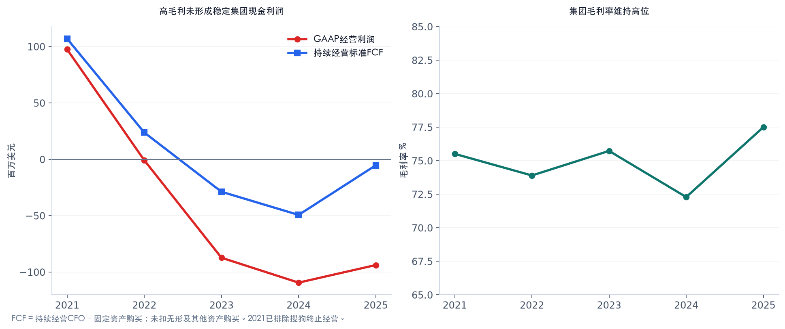
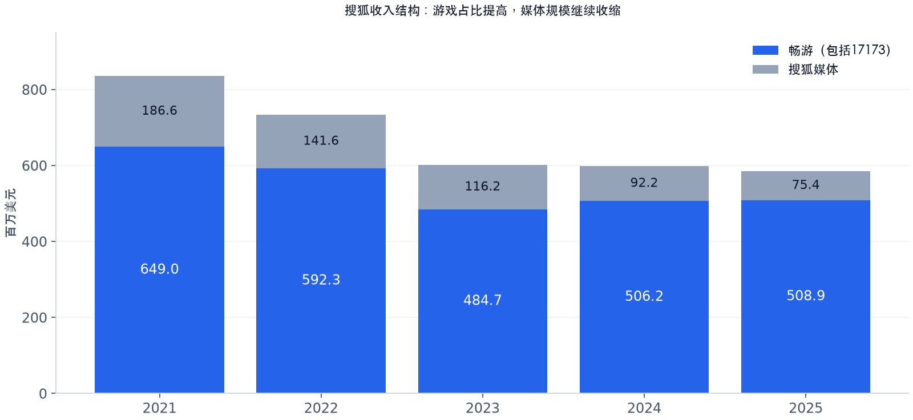

# 搜狐（SOHU）研究报告

**研究日与信息截止日：2026-10-09，北京时间。** 财务截止至2026-06-30，年度审计数据至2025-12-31；最新核验正式披露为2026-09-16股东大会结果。行情取2026-10-08美国常规盘收盘12.53美元，已与Yahoo Finance及StockAnalysis核对。金额除另注外均为百万美元；价格为美元/ADS。

上市主体为开曼注册的Sohu.com Limited，NASDAQ代码SOHU，1 ADS代表1普通股；不与已经退市的畅游CYOU、搜狗SOGO混同。沿用既有「搜狐」报告目录及触发配置ID。按2025年末已披露在外26,069,022股复算市值326.645百万美元；**这是假设股数未变的保守估值分母，并非声称10月的准确在外股数**。2026年回购使实际股数可能更低。

搜狐仍拥有高利润的老游戏业务及大量现金，但媒体投入持续消耗游戏利润。投资成立需要价格折让，也需要现金能在合理时间内回到股东。

## AI研究偏见自觉

**信息丰富度评级：B级。** SEC财报充足，财务可研究性接近A级；玩家留存、媒体变现、境外各层级可分配现金及创始人的资本配置意图披露不足。上市时间长不等于经营变量都能看清。

**AI研究局限性声明：** 当前股数、2026Q2现金地域分布和季度现金流没有完整更新；不能把推算写成事实。Macrotrends本次收入及净利页面返回403，以SEC审计年报/季度原件与StockAnalysis独立数据库替代。媒体分部及长期定存等细项仍有独立二源缺口，见附录；SEC与公司IR属于同一原始来源。

- [x] 把账上现金与少数股东可兑现现金区分。
- [x] 把税务转回、搜狗处置与持续经营盈利区分。
- [x] 不因资料丰富而提高对资本配置意图的确定感。
- [x] 同时检验“价值陷阱”和“真实回购创造每股价值”两种解释。

本次核验对[8月报告](搜狐-research-20260827.md)有重要修正：境内利润再投资政策不等于永久不分红；畅游评估诉讼已在2025年12月和解；境外银行存款不形成股价硬底；44.45%实益持股不等于个人最终经济权益；2021持续经营FCF为正。旧报告保留为历史记录，当前判断以本报告核验口径为准。[S1][S2][S7]

---

## 第一步：核心数据总览

### 五年趋势

| 指标 | 2021 | 2022 | 2023 | 2024 | 2025 |
|---|---:|---:|---:|---:|---:|
| 收入 | 835.576 | 733.872 | 600.672 | 598.399 | 584.333 |
| 毛利率 | 75.51% | 73.90% | 75.73% | 72.29% | 77.50% |
| GAAP经营利润 | 97.472 | -0.873 | -87.310 | -109.401 | -93.805 |
| GAAP经营利润率 | 11.67% | -0.12% | -14.54% | -18.28% | -16.05% |
| 持续经营归母净利 | 69.274 | -17.343 | -65.805 | -100.269 | 394.095 |
| 持续经营CFO | 113.610 | 32.242 | -25.567 | -48.018 | -4.762 |
| 固定资产购买 | 6.718 | 8.506 | 3.225 | 1.315 | 0.576 |
| 标准FCF | 106.892 | 23.736 | -28.792 | -49.333 | -5.338 |
| 现金、短期投资与长期定存合计 | 1,587.301 | 1,437.247 | 1,348.887 | 1,235.715 | 1,181.339 |

标准FCF定义为持续经营CFO减固定资产购买。2025另有9.081百万美元购入无形及其他资产，再扣这一项的现金流为-14.419百万美元；低固定资产Capex不代表维持游戏IP和内容无需再投入。2021已排除搜狗终止经营CFO，当年总口径FCF为负，不能用于评价现在的业务。[S1][S2][S3][S6]

2025归母净利394.095百万美元主要受一次性税务收益影响：Toll Charge相关头寸转回199.018百万美元，以及畅游股利预提税递延负债转回约283.6百万美元。集团当年税前仍亏49.523百万美元，所得税收益443.609百万美元。将这一年利润乘上常规PE，会把不能重复的税务收益资本化。[S1]



### 最近四个已披露季度

| 指标 | 2025Q3 | 2025Q4 | 2026Q1 | 2026Q2 |
|---|---:|---:|---:|---:|
| 总收入 | 180.161 | 142.260 | 141.284 | 135.540 |
| 营销服务收入 | 13.596 | 17.027 | 12.560 | 15.179 |
| 在线游戏收入 | 162.036 | 120.361 | 124.567 | 116.171 |
| 其他收入 | 4.529 | 4.872 | 4.157 | 4.190 |
| 毛利 | 145.295 | 107.074 | 111.476 | 106.584 |
| GAAP经营利润 | 13.580 | -66.042 | -6.732 | -18.299 |
| 持续经营归母净利 | 8.666 | 223.285 | -4.315 | 0.235 |
| 畅游经营利润（公告约数） | 87 | 45 | 65 | 55 |

2025Q4经营亏损包含商誉减值；StockAnalysis标准化表剔除该项，显示-29.09百万美元。2026Q2的0.235百万美元持续经营利润含约13百万美元税务转回；再加终止经营收益0.734百万美元，才是第三方总口径净利0.969百万美元。Non-GAAP也保留这一季度税务收益，不能自动视为“正常盈利”。Q2未披露完整现金流量表，不把年初至今现金池变化倒算成FCF。[S4][S5][S6]

2026Q3公司指引为营销收入14–15百万美元、游戏收入105–115百万美元、GAAP与Non-GAAP归母净亏13–23百万美元。游戏同比降幅29%–35%，与2025Q3《天龙八部：归来》上线高基数相关。公司没有给出总收入指引，广告与游戏之和不能冒充总收入。[S5]

> 芒格式追问：扣掉税务转回之后，集团靠什么稳定产生可以分给股东的钱？

---

## 第二步：生意本质分析

**这门生意的本质：老玩家为角色、社群和持续内容付费，畅游赚取游戏利润；集团再把其中相当部分投入媒体产品与获客。**

| 2025分部 | 收入 | 收入占比 | 毛利率 | GAAP经营利润 | 钱从哪里来 |
|---|---:|---:|---:|---:|---|
| 搜狐媒体 | 75.413 | 12.91% | 22.84% | -330.573 | 广告、视频订阅、直播及其他服务 |
| 畅游（含17173） | 508.920 | 87.09% | 85.60% | 236.768 | 道具付费、游戏授权/分成、游戏门户广告 |
| 合并 | 584.333 | 100.00% | 77.50% | -93.805 | 游戏毛利未覆盖全部集团费用 |

畅游包含17173，不能把畅游分部收入与在线游戏收入完全画等号。2025在线游戏收入505.738百万美元，其中PC约412.7百万美元、手游约93.0百万美元。TLBB PC单款约306.9百万美元，产品集中度高。[S1][S6]



免费游戏的复购依靠角色成长、稀有道具、社群关系及版本更新；用户已有投入能延缓迁移，但不能阻止新玩家流向竞品。广告客户按曝光、活动效果与流量质量付费，预算可在短视频、社交和其他媒体之间迁移。

搜狐集团的高毛利率主要由游戏贡献。2026Q2游戏收入毛利率约88.10%，营销收入毛利率约11.72%；两者经济性差异很大。集团2025产品开发费用247.507百万美元，占收入42.36%，费用并不只服务于畅游。仅看77.50%集团毛利率会误判规模效应。[S1][S5]

决定利润的三个变量是：天龙系列的付费人数与每名付费者收入；新品上线后的留存；媒体费用下降能否快于收入下降。2025媒体收入相较2021下降59.59%，费用调整却不足以让集团持续盈利。媒体剔除36.955百万美元商誉减值后的经营亏损为293.618百万美元，较2024收窄4.01%；有改善，但量级仍超过畅游经营利润。[S1][S2]

> 段永平式追问：这门生意好在哪？老游戏长线运营有价值，但为什么必须同时拥有一门消耗其利润的媒体业务？

---

## 第三步：护城河评估

| 护城河 | 证据 | 判断与可证伪条件 |
|---|---|---|
| 品牌与定价权 | 天龙IP和搜狐品牌仍有识别度 | 游戏存在细分品牌；媒体品牌未转化为广泛广告议价权。提价后付费人数及留存才是检验 |
| 转换成本 | 老玩家的角色、装备、社交关系 | 单款游戏内部中等；跨游戏迁移仍可能发生，付费账户持续下滑会否定判断 |
| 网络效应 | 公会、交易及多人玩法 | 局部有效，不能自动外推为跨产品平台网络效应 |
| 规模效应 | 游戏高毛利，长期运营团队 | 畅游有效，集团弱。媒体固定研发及营销支出吞噬利润 |
| 技术及授权 | 游戏软件、长期运营与文学IP授权 | 运营经验有门槛；未发现可核验的独占AI优势。核心IP续约和腾讯手游分发构成依赖 |

2026Q2 PC平均月活账户约260万、季度付费账户约100万；手游分别约170万和20万，后者同比下降13%与24%。这些是账户数，不是去重自然人数。老PC产品仍有生命力，手游对新产品的接续尚未得到证明。[S5]

过去五年，集团整体护城河趋窄；畅游的局部存量壁垒仍在。未来五年不能只凭天龙老IP推出护城河扩大，需要看到新品留存、付费结构及授权续约。竞争对手拥有足够资本也不一定能复制老玩家社群，但能用更好的产品争取新增用户；搜狐最缺的不是账上资金。

> 巴菲特式追问：十年后这条护城河还在吗？它最可能被新玩家不足、产品老化和授权条件变化侵蚀。

---

## 第四步：逆向思考与风险清单

**最强反方：即使现金真实存在，只要媒体持续消耗、股东回报缓慢，今天的折价也可以长期维持。** 投资者可能正确算出资产价值，却错误判断价值兑现时间。

| 失败路径 | 概率判断（主观） | 影响 | 可观察信号 |
|---|---|---|---|
| 媒体亏损长期抵消游戏利润 | 高 | 现金池持续减少，等待成本累积 | 非减值媒体亏损、集团CFO及内容/IP现金支出 |
| 老游戏衰退，新品只有上线脉冲 | 中高 | 核心现金来源削弱 | PC/手游付费账户、版本后留存、游戏收入与利润 |
| 回购额度用尽后没有接续 | 中 | 资产折价缺少资本回报推动 | 新授权金额、实际支出、扣除发行后的净股数 |
| 跨境分配意向与程序阻碍 | 中高 | 账面现金难按期兑现 | 分派政策、逐层可分配利润、现金主体及预提税 |
| 关联互贷难以抵销或收回 | 中，缺乏后续拆分 | 流动资产回收与负债结算不对称 | Fox Financial双方余额、抵押及法律处置 |
| VIE、监管或上市地位重大变化 | 低至中，无法精确量化 | 尾部大幅损失 | SEC及中国正式监管披露 |
| 私有化报价或程序不利 | 条件性，无法量化 | 兑现价格低于研究预期 | 正式交易文件、ADS异议程序、资金安排 |

概率等级是分析判断，不能当作历史频率。估值另列零回收尾部档，不把上述离散事件塞进更高β。

历史上门户可以出售资产或私有化，也可以继续消耗资金；新浪等案例只说明路径存在，不能提供搜狐的时点或合理报价。可采用代理问题和沉没成本两种模型理解：管理层可能重视平台影响力，少数股东重视现金回报；媒体的既有投入也可能让停止投入变得更难。这是解释假设，需要资本配置行为验证，不能从公开活动推断个人心理。

应同时承认多方证据：历史回购是真实支出，年报披露了回购股份取消；畅游仍有经营利润，媒体非减值亏损也有所收窄。把改善概率预先设成零，与把现金当作无条件价格底，都容易出错。

> 芒格式追问：聪明人为什么不买？因为他们缺的可能不是估值知识，而是愿意等待多久及如何改变资本配置的答案。

---

## 第五步：管理层评估

| 时间 | 决策或行为 | 结果 | 评价 |
|---|---|---|---|
| 2020 | 畅游私有化 | 集团持有游戏现金创造能力 | 经营整合有价值；交易公平性不能凭整合效果倒推 |
| 2021 | 搜狗出售 | 大量资金及一次性处置收益 | 强化资产负债表；不能当持续盈利 |
| 2023–2025 | 继续投入媒体、保留游戏业务 | 游戏盈利，集团经营持续亏损 | 资本配置仍未证明合并价值超过分开价值 |
| 2024–2025 | 回购及历史取消股份 | 在外股数减少 | 对剩余每股价值有利；须扣掉回购现金成本，不能双计收益 |
| 2025Q4 | 畅游境内未分配利润再投资政策 | 冲回递延税，暂不预期跨境分派 | 当前分配意愿偏弱，政策并非永久不可改变 |
| 2026-08-08 | 回购计划改为开放式 | 取消截止日，金额仍为150百万美元 | 正面但有限：延长时间不等于扩容或承诺执行 |

截至2026-08-06，本轮已回购约940万ADS、成本约124百万美元，约剩26百万美元授权。公司可暂停或终止计划，不能预测“六个月必然用完”。历史取消股份与回购时从在外股数中剔除是不同环节。[S1][S5]

张朝阳兼任董事长与CEO。2026-02-20的SEC实益持股为11,462,100股、44.45%，含7万可行权期权及Photon股份。2026-03-18 Form 3交叉确认其直接343,700股、Photon间接11,048,400股及期权；Photon投票/处分权与其他董事共享，个人最终经济权益未完整披露。每普通股一票，没有依据把44.45%写成双层股权超额票权或个人全部经济产权。[S1][S7]

9月16日股东大会，张朝阳获得11,041,295赞成票、7,497,640 withheld票；withheld占列示董事票约40.44%，仍按plurality规则当选。这提示相当部分股东保留意见，但不能据此认定某机构发起行动主义，也不能把未发现外部控制权争夺写成“从未存在”。[S8]

管理团队长期稳定是运营优点；创始人依赖及交错董事会降低外部股东迅速改变配置的能力。研发回报率、个人薪酬明细和媒体活动ROI不足以可靠量化，不给伪精确评分。

> 段永平式追问：如果CEO退休，游戏运营团队可能延续；集团现金分配和媒体战略会如何变化，目前没有足够证据。

---

## 第六步：行业与文明趋势

中国游戏行业仍在增长。2026H1国内游戏销售收入1,884.5亿元，同比增长12.17%；客户端收入452.88亿元，同比增长27.92%。新华社现场报道与澎湃独立报道一致。2025国内游戏收入3,507.89亿元，同比增长7.68%，客户端增长14.97%。行业并非天然萎缩，搜狐需要用产品表现解释自己的增长与回落。[S9][S10]

2025畅游PC美元收入同比增长14.86%，手游下降35.01%。前者与国内端游行业增速接近，后者明显较弱；美元与人民币、净分成与行业总流水、跨端分类不一致，不能直接据此计算精确市占率。所谓“游戏在增长行业全面丢份额”过于笼统。[S1][S9][S10]

| 对手或替代品 | 竞争维度 | 对搜狐的含义 |
|---|---|---|
| 腾讯、网易 | 新游戏供给、分发、跨产品用户运营 | 老IP需要持续更新；畅游手游还依赖腾讯发行 |
| 抖音、快手及社交平台 | 广告预算、时间和创作者 | 搜狐媒体必须以差异化内容和可证明效果竞争 |
| 爱奇艺等视频服务 | 内容、付费和长视频注意力 | 扩大版权投入不自动形成回报 |

AI可能降低内容与开发工具成本，也会增加供给、强化大平台推荐能力。搜狐尚未披露可验证的AI盈利优势。新卡牌、小游戏及海外项目仅视作期权，不纳入基准稳定利润；公开转录存在数字与标题误听，必须等待公司正式产品及经营数据。

行业TAM不是搜狐的收入上限预测：能获取多少新增付费用户、能否保住老用户、要付出多少获客费，决定价值归属。天龙相关IP授权、腾讯手游分发构成集中依赖；年报披露2025年前五大广告代理/客户占营销服务收入24%，这是已披露的一手单源集中度；客户留存和活动ROI仍缺量化证据。

> 李录式追问：二十年后回看，搜狐更可能是一组仍有价值的老品牌与游戏资产；现有证据不足以把它视为平台级文明增长的主要受益者。

---

## 第七步：估值与安全边际

### 当前价格如何理解

所有主估值采用2025末26.069022百万股，便于复现并避免把季度加权股数当时点股数。由累计回购约数推到约24.524百万股只能作敏感性；若这一估计成立，正价值每股数约提高6.30%，不能因此认为10月的精确股本已验证。

| 指标 | 数值 | 含义及限制 |
|---|---:|---|
| 股价 | 12.53 | 2026-10-08常规盘收盘 |
| 按年末股数复算市值 | 326.645 | 不是10月精确股数市值 |
| TTM收入 | 599.245 | 四个已披露季度加总 |
| PS | 0.545x | 低收入倍数，但集团亏损 |
| 每股账面净资产 | 49.245 | 2026Q2归母权益除保守股数 |
| PB | 0.254x | 低PB不提供分配保证 |
| 报表EPS对应PE | 1.449x | 用第三方TTM EPS 8.65验算；受税务收益扭曲 |
| 2025标准FCF收益率 | -1.63% | 历史年度值，不冒充最新TTM |
| PEG | 不适用 | 正常利润及增长率不足以可靠定义 |

现金不能只用一个数字：

| 2026Q2资产口径 | 金额 | 每股值 | 用法 |
|---|---:|---:|---|
| 现金等价物加短期投资 | 832.976 | 31.953 | 窄口径，二源可核 |
| 加长期定存后的现金池 | 1,161.732 | 44.564 | 长期定存仍有独立二源缺口 |
| 现金池减全部负债 | 828.260 | 31.772 | 本报告保守资产锚，非标准净现金/清算价 |

减全部负债已覆盖已入账互贷、税务、运营等负债，估值不能再重复扣一遍。2025末Fox Financial互贷应付34.123百万美元、对应应收33.924百万美元尚未实际互抵；Q2没有更新拆分，所以不采用“有息债务为零”的断言。[S1][S5]

若仍沿用年末约34.1百万美元互贷负债，并把全部长期定存视作现金，示意EV为-800.987百万美元、EV/TTM收入为-1.337x。**该EV混合了不同时点负债、包含长期存款、且未证明可分配，不用于定价**。第三方标准EV只计窄现金并采用不同债务分类，负EV数值不可直接并排比较。

2025末约41%现金池在境外，按当时池数估计约484.349百万美元；这一比例不能直接更新到Q2，更不意味着上市母公司可立即分红。再投资意向改变可能产生税负，未确认税额与未分配利润也不是全部现金的统一扣税率。[S1]

自身历史PE在亏损年份没有比较意义，2021出售收益及2025税务转回又使利润倍数失真。第三方FY2023/FY2024/FY2025 PS约0.56x/0.71x/0.81x可作历史参照，但受历史股数影响，未作统一重算，不据此确定买点。[S6]

同业比较也应看现金回报机制：网易拥有持续盈利、分红和更多产品来源；微博也有派现，且需要扣其自身债务。搜狐的低PB不能通过简单均值回归推成同业倍数。当前第三方网易约15.89x PE、微博约5.32x PE，仅作单源页面快照，未完成完整同日二源估值审计，不作为本报告终值倍数输入。[S11]

### 反向DCF与三年资产情景

以828.260百万美元为现金减全部负债的初始资产锚。模型不加楼宇售价，不叠加整家畅游的利润倍数，也不预先计算未来回购收益。忽略其他资产回收及未来新增负债是模型限制。

定义年度净消耗B，覆盖集团经营净现金消耗、内容/IP再投入与现金收益等合计；定义兑现比例α，代表期末能通过分配、收购或退出价格反映到少数股东的资产比例，包含未计税费与配置折让，**不是一次事件发生概率**。回购若发生，须同时重算资产池及股数。各参数均为判断假设，不是公司指引。

三年模型：每股现值 = α × (828.260 − 3B) ÷ 26.069022 ÷ (1+r)^3，美元要求回报r取10%。

| 三年情景 | 年度净消耗B | 兑现比例α | 三年退出等价每股值 | 今日每股现值 | 按12.53买入的情景年回报 |
|---|---:|---:|---:|---:|---:|
| 悲观 | 40 | 25% | 6.792 | 5.103 | -18.46% |
| 基准 | 10 | 50% | 15.311 | 11.503 | +6.91% |
| 乐观 | 0 | 80% | 25.417 | 19.097 | +26.59% |

这是一组有条件资产现值，不是预测三年后必然退出。基准假设要求净消耗接近2025广义再投入现金流量级，并且现金在三年内形成股东价值。悲观假设以近年负现金流压力作参照；乐观需要经营止损及明确资本回报。

逆推：三年年消耗10百万美元，要让12.53获得10%年回报，期末兑现比例需54.46%。若等待十年、每年消耗10百万美元且无新增盈利，所需兑现比例达116.34%，超过全部回收。因此市场定价包含更快兑现、业务盈利改善或更低要求回报的预期；低PB不能替代这些条件。

按技能要求执行了利润PE三情景适用性检验：Q2持续经营净利减约13百万美元税转回再简单年化，压力EPS约-1.959；程序给出负目标价。这只是证明该方法不适用，**没有把季度年化当全年盈利预测，也没有将负目标价当资产价值**。正式三情景采用以上十进制资产模型。

### 十年折现与终值

终值公式仍使用 PE = (1 − g/ROIC)/(r − g)。由于集团当前缺乏稳定正盈利，它只适用于乐观档假设的恢复经营；基准/悲观不把负利润硬套PE。

| 输入 | 本报告判断 |
|---|---|
| 币种与r | 美元现金流；r=10%，敏感性9%和11%。Rf=4.7%、β=1、ERP=5.3%为模型参考假设，未声称最新国债报价 |
| ROIC | 假设恢复后的增量ROIC为15%；当前集团利润/派息不足以可靠夹定稳态ROIC，故仅为条件情景，不是已测得能力 |
| 永续g | 悲观0%、基准0%、乐观2%；不随r改变。美元基准上限4%，本报告低于该限 |
| 第十年可资本化净利润 | 悲观及基准为0，乐观20百万美元；这是经营恢复假设，与账上税务利润无关 |
| 现金与兑现 | 同一年度净消耗40/10/0，十年后兑现比例25%/50%/80%；此前无派现，股数固定 |

第十年可回收总值 = α × [828.260 − 10B + max(净利润,0) × 终值PE]。乐观档的20百万美元是**扣除经营相关税费、剔除存量现金利息后的税后可分配利润假设**，避免与存量现金重复计值；前十年整体净现金流为零，仅在终值进入恢复利润，属于保守而离散的恢复路径。

| 十年情景（r=10%） | 终值PE | r−g分母 | 期末可回收总值 | 今日每股现值 | 情景年回报 |
|---|---:|---:|---:|---:|---:|
| 悲观 | 10.000x（利润为零） | 10个百分点 | 107.065 | 1.583 | -10.55% |
| 基准 | 10.000x（利润为零） | 10个百分点 | 364.130 | 5.385 | +1.09% |
| 乐观 | 10.833x | 8个百分点 | 835.941 | 12.363 | +9.85% |

| 折现率敏感性 | 悲观每股现值 | 基准每股现值 | 乐观每股现值 | 分母（悲观/基准/乐观） |
|---|---:|---:|---:|---|
| r=9% | 1.735 | 5.900 | 13.946 | 9/9/7个百分点 |
| r=10% | 1.583 | 5.385 | 12.363 | 10/10/8个百分点 |
| r=11% | 1.446 | 4.919 | 11.033 | 11/11/9个百分点 |

三情景顺序稳定；乐观档现值是否高于现价随r变化，说明现价不能靠十年乐观终值提供稳健安全边际。基准无运营终值时，等待时间比退出PE更重要。

另设VIE/上市地位严重失效、可回收为零的尾部档。仅为压力演示，赋予悲观/基准/乐观/尾部25%/45%/20%/10%的主观权重，对应三年每股现值10.271、十年5.292。**这些不是校准概率，不把概率加权IRR误称可实现收益**；尾部风险是情景折损，没有提高r或β。

未单独建模人民币汇率路径及具体私有化条款。未来资产/负债、受限存款、再分派税款与法律程序可能改变现金锚；兑现比例只能粗略吸收，不能代替逐项核实。尚未获得ROIC15%的经验验证，是乐观经营终值的主要限制。

> 巴菲特式追问：如果r错两个百分点，结论会翻转吗？乐观估值可能翻转，观望和不重仓的结论不变。
>
> 段永平式追问：股市关闭五年，你愿意持有吗？没有现金回报路径时，仅凭资产折价不足以支持长期重仓。

---

## 第八步：最终决策与行动清单

**建议：现价12.53美元观望；长期核心仓回避，事件型小仓须等待价格与经营条件同时满足。** 本次比8月报告更重视兑现时间，也更严格区分治理折价与可分配资产。

| 维度 | 结论 | 信心度 |
|---|---|---|
| 生意质量 | 畅游存量业务有价值，集团现金生产不稳定 | 中高 |
| 护城河 | 天龙老玩家局部粘性，媒体及新品接续弱 | 中 |
| 管理层 | 回购是真实正面行为，持续媒体投入拖累配置 | 中高；未来意图低 |
| 最大风险 | 现金真实性之外，兑现速度和现金消耗 | 高 |
| 文明趋势 | 游戏行业增长未自动转为搜狐长期增长 | 中高 |
| 估值 | 资产折价明显，现价对兑现假设仍敏感 | 模型算数高、假设中低 |

| 价格或状态 | 空仓者 | 持仓者 |
|---|---|---|
| 8–10美元 | 仅在Q3/后续披露证实现金回报持续及经营未恶化时，研究性小额分批 | 符合经营条件才考虑增加；跌价不自动摊低 |
| 10–15美元，含当前12.53 | 观望，等待回报与成本证据 | 有明确事件逻辑可保留小仓；不因PB低加仓 |
| ≥15美元且证据未增强 | 不追高，重新评估兑现路径 | 复核减仓与机会成本；警戒线不是自动卖出价 |
| 无论价格 | 若现金消耗加速、回购中断且无替代回报或交易条款不利，回避新仓 | 重新审核持仓依据，必要时退出 |

8–10美元相对三年基准现值11.503美元提供约13.07%–30.45%折让。该区间**不能保护十年停滞情景**，所以仍须催化剂；更低价格也不能跨过财务或治理红线。研究性事件仓建议不超过可投资资产1%–2%，这是本报告风险预算判断，非对用户资产情况的个性化配置。

加仓证据：实际回购持续并有合理接续、净股数继续减少；媒体非减值亏损继续收窄；游戏付费账户及收入未跌破指引且新品不只短期冲量；完整现金流能覆盖内容/IP投入。仅延长回购日期或低PE不够。

减仓/卖出证据：媒体现金消耗显著扩大并持续两个报告期；游戏经营利润下降而费用未收缩；回购停止且无派息/资产处置替代；重大关联交易、跨境提取或私有化文件损害少数股东。正常市场波动本身不改变生意判断。

**复检：2026-11-16作为Q3披露日历检查点。** 这是第三方估计，截止研究日没有核验到公司正式预约日期；实际公告优先。届时核游戏指引、媒体亏损、回购进度、股数及现金池；2026-12-31再复核资本回报接续，不把这一日期称私有化截止日。

以下是依据方法论的模拟点评，并非四位投资者的真实言论：

> 段永平：价格低不够；要先确认游戏利润没有被无效投入长期抵消。
>
> 巴菲特：账上资产是起点，合理时间内的股东现金流才是投资价值。
>
> 芒格：最容易犯错的地方，是算对现金金额，却算错自己何时能拿到它。
>
> 李录：行业增长值得研究，但新增价值是否归到这家公司，要用产品和资本回报证明。

---

## AI分析置信度与投资确定性

**AI分析置信度：财务事实中高、法律细节中、经营前景与资产兑现假设中低。投资确定性：低至中低。** 两者不能混同。

充分证据支持的结论：媒体与畅游盈利差异、税务收益的性质、历史回购、ADS比例、年末现金及已披露地域比例、最新Q3指引。有限信息推理：未来现金消耗、兑现比例、三年催化剂、稳态ROIC及恢复利润、创始人的未来分配选择。

需要一手补充的问题：

1. 各主体境内外可分配现金、法定留存、跨境税费与实际计划分别是多少？
2. 本轮额度耗尽后是否新增回购或派息，年度净现金回报目标是什么？
3. 天龙新品的付费留存、老玩家年龄和新增用户结构怎样？建议产品体验和玩家访谈核验。
4. 媒体研发、版权、活动投入的商业回报和费用削减目标是什么？
5. Fox Financial互贷何时解决，畅游诉讼和解金额及会计归属是什么？

---

## 数据来源与审计记录

### 来源索引

| 编号 | 来源 | 用途 |
|---|---|---|
| S1 | [FY2025 SEC 20-F](https://www.sec.gov/Archives/edgar/data/1734107/000119312526102990/d22394d20f.htm)、[分部原表](https://www.sec.gov/Archives/edgar/data/1734107/000119312526102990/R39.htm) | 年度报表、税务、分部、股权、地域、诉讼与互贷 |
| S2 | [FY2023 SEC 20-F](https://www.sec.gov/Archives/edgar/data/1734107/000119312524069620/d507223d20f.htm)、[FY2022 SEC 20-F](https://www.sec.gov/Archives/edgar/data/1734107/000119312523084383/d415397d20f.htm) | 早期持续与终止经营口径、年度时间序列 |
| S3 | [StockAnalysis收入表](https://stockanalysis.com/stocks/sohu/financials/income-statement/)、[现金流表](https://stockanalysis.com/stocks/sohu/financials/cash-flow-statement/) | 独立数据库对照，保留标准化差异 |
| S4 | [2025Q3 SEC业绩](https://www.sec.gov/Archives/edgar/data/1734107/000119312525283862/d58399dex991.htm)、[2025Q4 SEC业绩](https://www.sec.gov/Archives/edgar/data/1734107/000119312526041851/d48198dex991.htm) | 四季收入与利润 |
| S5 | [2026Q2 SEC业绩原件](https://www.sec.gov/Archives/edgar/data/1734107/000119312526341231/d165270dex991.htm) | 最新损益、资产负债、指引及回购 |
| S6 | [StockAnalysis概览](https://stockanalysis.com/stocks/sohu/financials/)、[季度表](https://stockanalysis.com/stocks/sohu/financials/?p=quarterly)、[资产负债表](https://stockanalysis.com/stocks/sohu/financials/balance-sheet/)、[价格历史](https://stockanalysis.com/stocks/sohu/history/)、[Yahoo行情](https://finance.yahoo.com/quote/SOHU/history/) | 年度及季度交叉核验、收盘价与股数 |
| S7 | [张朝阳2026-03-18 Form 3](https://www.sec.gov/Archives/edgar/data/1734107/000119312526112305/xslF345X06/ownership.xml)、[枢密院判决](https://jcpc.uk/cases/judgments/jcpc-2023-0018)、[独立法律解释](https://www.collascrill.com/articles/landmark-judgment-privy-council-confirms-minority-shareholders-have-dissent-rights-in-short-form-mergers/) | 股权形式与异议权边界；和解状态取S1 |
| S8 | [2026-09-16 AGM结果](https://www.sec.gov/Archives/edgar/data/1734107/000119312526392475/d159594d6k.htm)、[SEC最新申报索引](https://data.sec.gov/submissions/CIK0001734107.json) | 披露完整性与治理更新 |
| S9 | [新华财经2026H1游戏产业](https://www.cnfin.com/gs-lb/detail/20260730/4448261_1.html)、[澎湃现场报道](https://www.thepaper.cn/newsDetail_forward_33688931) | 行业规模二源对照 |
| S10 | [游戏协会2025报告发布](https://www.cadpa.org.cn/3277/202512/41770.html)、[澎湃2025报告报道](https://www.thepaper.cn/newsDetail_forward_32211992) | 年度行业数据 |
| S11 | [网易统计页](https://stockanalysis.com/stocks/ntes/statistics/)、[微博统计页](https://stockanalysis.com/stocks/wb/statistics/)、[网易2025业绩](https://ir.netease.com/node/15256) | 资本回报与同业参照，数值快照不作为终值输入 |

### 关键数据交叉验证

| 数据点 | 原始或主源 | 独立对照 | 处理 |
|---|---|---|---|
| 10月8日收盘 | Yahoo chart API 12.53 | StockAnalysis历史12.53 | 同日同口径 |
| 2025收入 | SEC 584.333 | StockAnalysis 584.33 | 偏差小于0.01% |
| 2025归母净利 | SEC 394.095 | StockAnalysis 394.10 | 偏差小于0.01% |
| Q2现金等价物 | SEC 116.224 | StockAnalysis 116.22 | 偏差小于0.01% |
| Q2短期投资 | SEC 716.752 | StockAnalysis 716.75 | 偏差小于0.01% |
| 2025末股数 | SEC 26.069022百万股 | StockAnalysis 26.07百万股 | 偏差小于0.01%；均不代表10月精确股数 |
| 2025经营利润 | SEC -93.805 | StockAnalysis -56.85 | 相差39.40%；差额36.955为商誉减值，采用SEC GAAP |
| 2025标准FCF | SEC CFO减固定购买 -5.338 | StockAnalysis -5.34 | 四舍五入一致 |
| 2026Q2净利润 | SEC持续0.235、总0.969 | StockAnalysis总0.97 | 明确口径后匹配，不拿总数冒充持续经营 |
| 管理层持股 | 20-F与Form 3 | 独立二源经济权益缺口 | 两份SEC文件交叉并非独立来源；未知个人最终经济权益 |
| 长期定存/现金地域/媒体成本及经营利润 | SEC原件 | 独立细项来源不足 | 保留为一手单源，禁止声称全表两源准出 |

StockAnalysis还把Q2其他长期负债0.264百万美元列为Total Debt，未充分反映年报互贷；现金回收模型减全部负债，规避该分类的不完整。季度加权25.451百万股也不能用于认定时点在外股数。

### 程序审计

使用项目financial_rigor的市值、估值与cross-validate命令；资产情景采用其Decimal上下文计算，避免calc表达式入口的浮点中间值。十年终值及总回收IRR用terminal_value核验；IRR命令以已计算期末总回收额、乘数1复核，乘数1是金额传递，不是对经营利润使用1倍PE。

估值口径audit对USD、r=9%/10%/11%、ROIC=15%、g=0%/0%/2%全部通过。人民币汇率与私有化条款标为未建模，已在限制中说明。终值公式审计通过不代表兑现假设已被验证。

数据抽检结果及原始程序输出见以下附录；来源不足的项目只作单源核验，模型假设只核算数与标注，不能伪造外部实证。数值准出不等于经营与法律结论得到完全独立验证。

*本报告用于学习研究，不构成投资建议。*


### 关键数据交叉验证记录（程序输出摘录）

以下保留实际程序输出；其中ROE为工具按期末BVPS的简化比值，税务收益及每股口径使其不宜用于判断稳态资本回报。

```text
============================================================
市值验算 (Market Cap Verification)
============================================================
  股价 (Price):       12.53 USD
  总股本 (Shares):    26.07M
  计算市值:           326.64M USD
  报告市值:           326.64M USD
  偏差:               0.00%

  ✅ 验证通过, 偏差仅 0.00%

============================================================
交叉验证: 2025收入 (Cross-Validation)
============================================================
  数据来源数: 2
  参考中位数: 584.33 百万美元

  ✅ SEC20F              : 584.33 百万美元  (偏差 0.00%)
  ✅ StockAnalysis       : 584.33 百万美元  (偏差 0.00%)

  ✅ 所有来源偏差 ≤ 1.0%, 数据一致

  共识值 (加权中位数): 584.33 百万美元

============================================================
交叉验证: 2025归母净利 (Cross-Validation)
============================================================
  数据来源数: 2
  参考中位数: 394.10 百万美元

  ✅ SEC20F              : 394.10 百万美元  (偏差 0.00%)
  ✅ StockAnalysis       : 394.10 百万美元  (偏差 0.00%)

  ✅ 所有来源偏差 ≤ 1.0%, 数据一致

  共识值 (加权中位数): 394.10 百万美元

============================================================
交叉验证: 2026Q2现金等价物 (Cross-Validation)
============================================================
  数据来源数: 2
  参考中位数: 116.22 百万美元

  ✅ SEC6K               : 116.22 百万美元  (偏差 0.00%)
  ✅ StockAnalysis       : 116.22 百万美元  (偏差 0.00%)

  ✅ 所有来源偏差 ≤ 1.0%, 数据一致

  共识值 (加权中位数): 116.22 百万美元

============================================================
交叉验证: 2026Q2短期投资 (Cross-Validation)
============================================================
  数据来源数: 2
  参考中位数: 716.75 百万美元

  ✅ SEC6K               : 716.75 百万美元  (偏差 0.00%)
  ✅ StockAnalysis       : 716.75 百万美元  (偏差 0.00%)

  ✅ 所有来源偏差 ≤ 1.0%, 数据一致

  共识值 (加权中位数): 716.75 百万美元

============================================================
交叉验证: 年末在外股数 (Cross-Validation)
============================================================
  数据来源数: 2
  参考中位数: 26.07 百万股

  ✅ SEC20F              : 26.07 百万股  (偏差 0.00%)
  ✅ StockAnalysis       : 26.07 百万股  (偏差 0.00%)

  ✅ 所有来源偏差 ≤ 1.0%, 数据一致

  共识值 (加权中位数): 26.07 百万股

============================================================
估值指标验算 (Valuation Verification)
```

### 抽检结论

已执行report_audit默认比例随机抽检：从188个提取候选抽取29个，剔除日期、阈值和申报表名等5个误匹配，实际24项数值核验全部通过，无偏差超限。事实、模型算数和单源项目分别记录，未把单源和假设标成独立二源验证。数值核验判决及全部抽检值保存在[抽检记录](assets-20261009/audit.json)，资产模型参数与精确结果见[估值记录](assets-20261009/valuation.json)。抽检与终值审计的通过不消除独立二源缺口。
